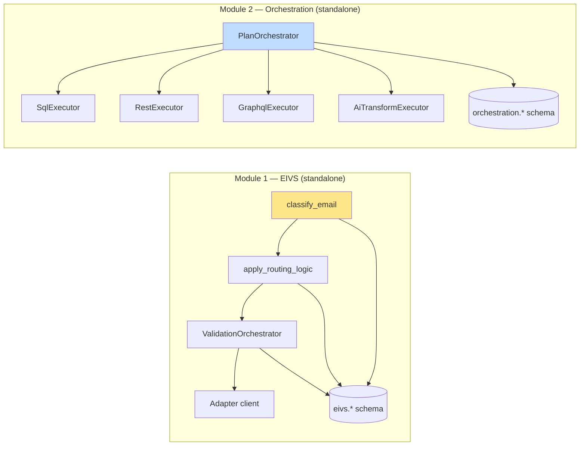
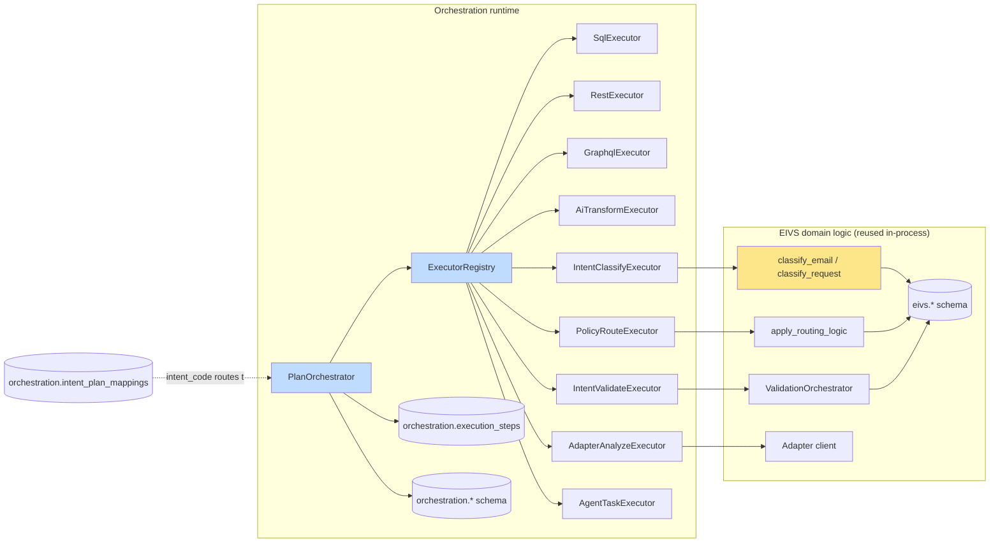

# ADR-001: EIVS + Orchestration Integration Architecture

**Status:** Accepted
**Date:** 2026-07-07
**Deciders:** Surya (Kasetti Technologies), reviewed by senior developer

## 1. Problem statement

We had two separate systems built for different purposes:

- **Module 1 (EIVS)** — a Python service that classifies inbound email
  intent, applies confidence-based routing policy, runs validation rules
  against source-of-truth data via an Adapter service, and persists the
  outcome. This logic is proven and has its own working demo
  (`loan_noc_email_processing`), but it was built email-specific: the
  classification entry point, its request/response shapes, and its
  schema (`eivs.*`) all assumed an email payload.

- **Module 2 (Orchestration)** — a FastAPI service with a React frontend
  that runs generic multi-step "plans" as a DAG: `sql`, `rest`,
  `graphql`, and `ai_transform` steps with dependencies, conditions,
  input bindings, timeouts, and concurrency control, all persisted to
  `orchestration.*`.

Neither system alone met the goal: EIVS had the governed business logic
but no general-purpose runtime; Orchestration had the runtime but no
domain intelligence for intent/validation. Rewriting EIVS's logic
inside Orchestration from scratch would have thrown away a working,
tested system for no benefit.

## 2. Options considered

**Option A — Rewrite EIVS logic inside Orchestration.**
Rejected. Would re-introduce bugs already fixed in EIVS's classification
and routing logic, and duplicate the `eivs.*` schema's business rules
inside `orchestration.*` for no reason.

**Option B — Keep the two services fully separate, call EIVS over HTTP
from an `orchestration` REST step.**
Rejected. Loses type safety, adds a network hop and a second point of
failure per step, and orchestration.execution_steps traces would show
only "called an HTTP endpoint" rather than the actual EIVS decision
(intent code, confidence, routing reason) — much weaker observability
for something this is meant to make more observable, not less.

**Option C (chosen) — Orchestration is the runtime of record; EIVS
logic is reused in-process as specialized step executors.**
`classify_email`, `apply_routing_logic`, and the Adapter client keep
their own module boundaries and their own `eivs.*` schema, but they run
inside the same Python process as the orchestrator, invoked through a
small executor wrapper per capability (`intent_classify`,
`policy_route`, `intent_validate`, `adapter_analyze`). No network hop,
full in-process tracing, and the EIVS code itself is untouched except
for a generalized request model.

## 3. Final decision

**Orchestration owns runtime execution, retries, dependency scheduling,
concurrency, and tracing. EIVS is reused as domain-intelligence step
executors registered into Orchestration's executor registry.**

Concretely:

- `orchestration.plan_steps.kind` was extended from `sql|rest|graphql|
  ai_transform` to also include `intent_classify`, `policy_route`,
  `intent_validate`, `adapter_analyze`, `prompt_run`,
  `document_generate`, `human_review`, `webhook`, and later
  `agent_task`.
- A `StepExecutor` abstract base + `ExecutorRegistry` replaced the
  orchestrator's original hardcoded per-kind dispatch, so adding a new
  kind means registering a new executor, not editing `PlanOrchestrator`.
- Each EIVS capability got a thin executor
  (`IntentClassifyExecutor`, `PolicyRouteExecutor`,
  `IntentValidateExecutor`, `AdapterAnalyzeExecutor`) that adapts
  orchestration's `StepExecutionInput`/`StepExecutionResult` contract to
  EIVS's existing functions — `classify_email` and
  `apply_routing_logic` are called directly, unmodified for the email
  path.
- `IntentClassificationRequest` was generalized to 12 `source_type`
  values (email, chat, document, api_event, support_ticket, claim,
  policy, patient_record, webhook_event, batch_row, form_submission,
  agent_output) so EIVS classification isn't locked to email going
  forward — `classify_email` stays as the proven, tested email path;
  a parallel `classify_request` function handles the other 11.
- `eivs.*` and `orchestration.*` stay separate schemas. They're linked
  by `execution_id` (added to `eivs.email_intent_runs` and
  `eivs.validation_runs`) rather than merged into one schema — each
  system keeps owning its own tables.
- `orchestration.intent_plan_mappings` routes an EIVS `intent_code` to
  the orchestration plan that should run for it, so an inbound intent
  can trigger a full plan without hardcoding that link anywhere.
- `orchestration.execution_steps` gives per-step tracing (request,
  response, error, evidence, duration, retry count) for every plan run,
  regardless of which kind of step it was.

### Current state (before this decision)

No connection between the two — an email flow could not be expressed
as an orchestration plan at all.

### Target state (this decision)

One runtime, one execution trace per step regardless of kind, EIVS logic
untouched and still owning its own schema.

## 4. Consequences

**Positive:**
- An email (or, going forward, chat/document/claim/etc.) intent flow is
  now a first-class orchestration plan — versioned, traceable per step,
  runnable through the same `/v1/orchestrations/run` entrypoint as any
  other plan.
- EIVS's proven classification/routing/validation logic wasn't rewritten
  or forked — the risk of introducing new bugs into working logic was
  avoided.
- New step kinds (including the later `agent_task`) plug into the same
  registry pattern, so this integration shape scales to future
  capabilities without another architecture change.

**Negative / accepted trade-offs:**
- EIVS and Orchestration now share a Python process and a database
  instance, which was previously two independently deployable services.
  Scaling or deploying them separately would require re-splitting this
  work.
- `services/eivs/*` still contains its own DB session handling
  (`SessionLocal`) separate from `services/db.py`'s connection pool —
  two different DB-access patterns coexist in one process. Not unified
  as part of this decision; flagged as a possible follow-up.
- Auth is currently fully stubbed open in `services/security.py`
  (`AuthContext` always returns `orchestration_admin`) — this decision
  doesn't address authn/authz; it's a separate, still-open concern.

## 5. Migration approach

The migration was additive, not a rewrite, in this order:

1. Runtime context models (`RuntimeContext`, `StepExecutionInput`,
   `StepExecutionResult`) added first, since every subsequent step
   depends on this shared contract.
2. Schema migration: extend `plan_steps.kind` CHECK constraint, add
   `execution_steps`, add `intent_plan_mappings`, link `eivs.*` tables
   to `execution_id`. All additive (`ADD COLUMN IF NOT EXISTS`,
   `CREATE TABLE IF NOT EXISTS`) so it's safe to re-run against an
   existing database.
3. `StepExecutor` base class + `ExecutorRegistry`, then
   `PlanOrchestrator` updated to call `registry.get(kind)` instead of
   hardcoded per-kind branches.
4. One EIVS executor at a time (`IntentClassifyExecutor` →
   `PolicyRouteExecutor` → `IntentValidateExecutor` →
   `AdapterAnalyzeExecutor`), each wrapping existing EIVS functions
   without modifying them.
5. Runtime APIs (`/v1/orchestrations/run` and friends), then the
   `loan_noc_email_processing` seed plan wiring EIVS intent + policy +
   validation rules + the orchestration plan + the intent-to-plan
   mapping together as a working end-to-end reference.
6. Frontend types/API client, then the new Studio pages (Intent
   Studio, Validation Studio, Plan Designer support for the new step
   kinds).
7. Agent framework (`agent_task` kind, budgets, approvals, tool
   registry, runtime loop) layered on afterward as its own extension of
   the same registry pattern.

## 6. Testing strategy

**Current state (as of this ADR):** thin. One backend test file
(`services/tests/test_plan_orchestration_collections.py`) exercises the
older `customer_360_collections` flow (`sql`/`rest`/`ai_transform`
only) — it does not cover the EIVS-integrated
`loan_noc_email_processing` flow, any individual EIVS executor, the
executor registry itself, or `agent_task`. There are no frontend tests.

**Intended strategy going forward** (tracked as separate backlog items,
not yet done):
- Unit tests per executor (`IntentClassifyExecutor`,
  `PolicyRouteExecutor`, `IntentValidateExecutor`,
  `AdapterAnalyzeExecutor`, `AgentTaskExecutor`), each with mocked EIVS/
  Adapter/LLM calls so they run without a live DB or network.
- One integration test that runs `loan_noc_email_processing`
  end-to-end against a seeded test database, asserting the full chain
  (`classify_email_intent` → `route_policy` →
  `validate_customer_and_loan` → `generate_customer_response` →
  `send_to_n8n_or_webhook`) produces the expected routing decision and
  evidence trail.
- Unit tests for `AgentTaskConfig`, `AgentBudgetManager`, and
  `AgentApprovalService` in isolation.
- One integration test for `agent_task` covering the full loop:
  tool call → budget check → approval gate → final answer validation.
- Frontend tests for the Visual Plan Designer (can a user add each
  step kind and save a valid plan) and the Execution Monitor (does it
  render a real execution's step trace correctly).